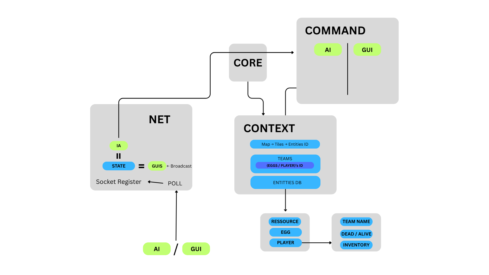

# Architecture

The server is separated into multiple modules, each responsible for a specific aspect of the game.

* **Networking:** Handles all network communication, including accepting client connections and sending/receiving messages.
* **Game Logic:** Contains the core game mechanics, such as player actions, resource management, and world updates.
* **Command Handling:** Parses and executes commands received from clients.

Modules are not strictly separated in terms of code organization, but they are conceptually distinct.
For example, the command handling module will interact with the game logic module to update the game state based on client actions (through shared references for example).
However, the core logic of the game is contained within the game logic module.

## Core Module

The core module contains the main server loop and the entry point of the application.
It initializes the server, starts the main loop, and manages the overall flow of the application.

### Code implementation

* ``zappy::server::Client``: Represents a connected client, including their socket and player information.
* ``zappy::server::Server``: Manages client connections and communication.

## Network Module

This module is responsible for managing client connections and communication.
It handles accepting new clients, receiving messages from clients, and sending messages to clients.
It also manages the list of connected clients and their associated player information.

### Code implementation

The network modules contains the following components:
* ``zappy::network::TcpSocket``: An interface representing a TCP socket class.
* ``zappy::network::ClientSocket``: Represents a client socket connection, including methods for sending and receiving messages.
* ``zappy::network::ServerSocket``: Manages the server socket, including accepting new client connections and managing existing connections.

## Game Logic Module

This module contains the core game mechanics, including player actions, resource management, and world updates.
It also contains the entity database, which is used to store and manage all game entities, including players, resources, and world objects.

### Code implementation

* ``zappy::game::IEntity``: An interface for all game entities, including players, resources, and world objects.
* ``zappy::game::EntityDatabase``: A database of all game entities, including players, resources, and world objects.
* ``zappy::game::entities::Player``: Represents a player in the game, including their inventory, and state.
* ``zappy::game::entities::Resource``: Represents a resource in the game, including its type.
* ``zappy::game::entities::Egg``: Represents an egg in the game, including the id of the player how birth it and hatch time.
* ``zappy::game::World``: Represents the game world, including the map, resources, and entities.

### Why entity database?

The issue in Zappy is that for some entities, like players or eggs, we need to have a way to access them both from the game world and from the network module.
We could use smart pointers or references to share the same entity between the two modules, but this can lead to issues with ownership and lifetime management.

So instead, we use an entity database that allows us to store and access entities in a centralized way. This allows us to have only one owner of each entity.
Then we reference the entities with their unique id.
This way, we can easily access the entities from both modules without worrying about ownership or lifetime issues.

## Command Handling Module

This module is responsible for parsing and executing commands received from clients.
It interacts with the game logic module to update the game state based on client actions.

### Code implementation

* ``zappy::ICommand``: An interface that represents a command received from a client, including the command name and arguments.
* ``zappy::CommandHandler``: Parses and executes commands received from clients.
* ``zappy::commands::<Command>``: Represents a specific command, including its name, arguments, and execution logic.

